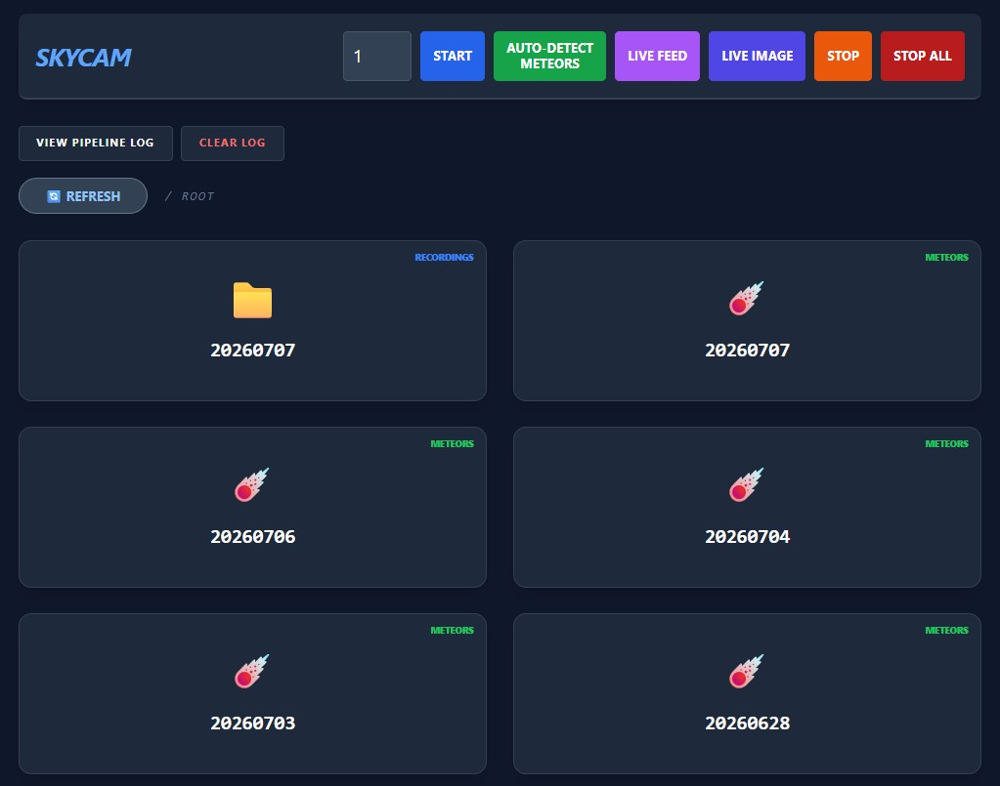
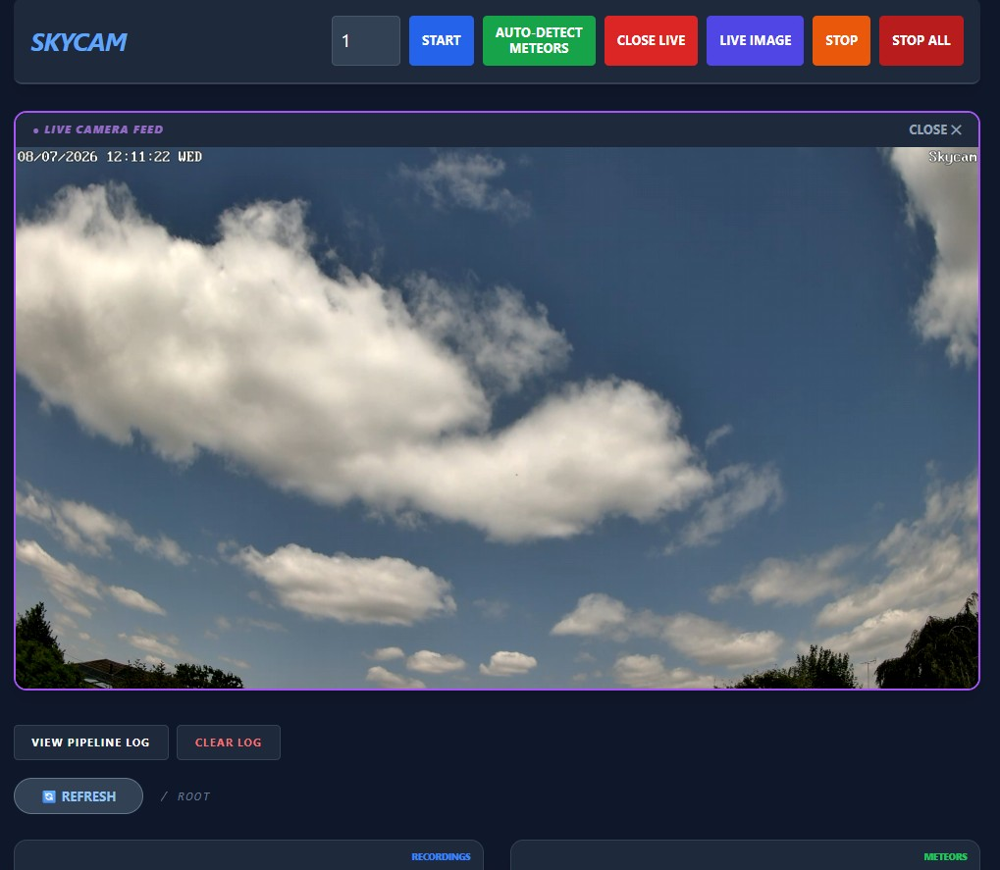
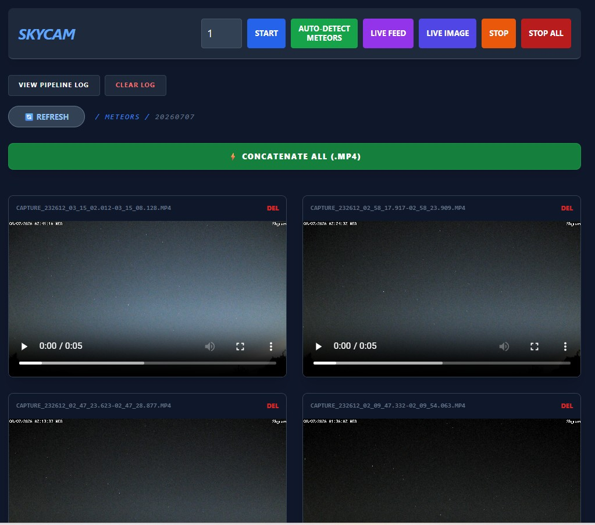
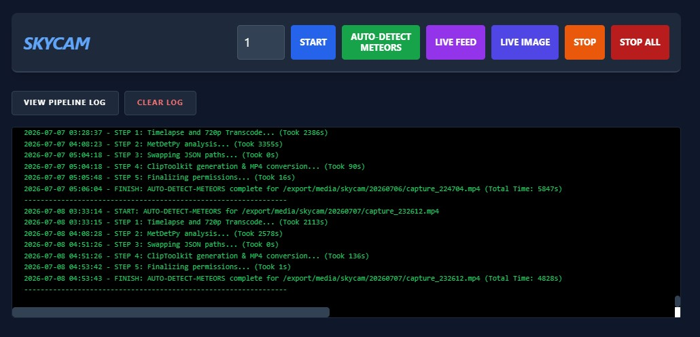

**The app/code in this repo is very specific to my personal setup - I don't expect it to work perfectly elsewhere - no in-depth help can be provided.**


# Background

I use a power-over-ethernet Reolink CX810 IP security camera mounted on a north-facing wall pointed at the sky - it produces crisp 4K footage during the day and due to its F1.0 lens and 1/1.8" sensor, very good **colour** low-light footage in hours of darkness without needing IR LED illumination.

This makes it an excellent way to observe footage of weather and other phenomena such as aurora, meteors and bolides.

Through a **LOT** of trial and error, **Gemini** coded this app and portions of the scripts for me as I am **not** a developer but I do have lots of Linux and other computing experience.

The app runs in Python/Flask on TCP/5050 via a Docker container.

# Main Function

**One-click recording/processing for meteor detection**

- When dark, manually set the length of recording (in hours)
- Press the "Auto-Detect Meteors" button
- It will record the RTSP stream from the camera of desired length, and once finished it automatically processes and clips the footage using [MetDetPy](https://github.com/LilacMeteorObservatory/MetDetPy)

In the morning, depending on sky clarity and meteor prevalance you should have a bunch of meteor clips that you can view.

With my hardware I achieve 30-60it/sec equating to ~5.7x speed, meaning a 4-hour recording can be processed in less than 45 minutes.

# Screenshots






# Other Features / Further explanation of one-click processing

- Start/Stop recording from 4K Reolink RTSP stream - useful to capture any footage without the meteor processing pipeline.
- Live feed of 4K Reolink RTSP stream
- 4K snapshot image from Reolink stream
- Button to transcode any previous recording or clip (only within the configured folders) to 720p
- Button to create 50x speed timelapse of any previous recording or clip (only within the configured folders)
- Button to concatenate all meteor clips into a single .mp4
- Basic file/folder management - deletion of individual recordings/clips/folders
  
- One-click recording and autodetection of meteors from recorded footage works like this:
  - The "Auto-Detect Meteors" button records 4K footage from the Reolink camera for the specified duration (set from the box next to "Start") then...
  - Once recording is complete, it transcodes the video to 720p (ready to feed to [MetDetPy](https://github.com/LilacMeteorObservatory/MetDetPy) to speed up processing).
  - Once transcoding is complete, [MetDetPy](https://github.com/LilacMeteorObservatory/MetDetPy) processes the 720p footage to detect meteors.
  - Any detections are then automatically clipped out using [MetDetPy](https://github.com/LilacMeteorObservatory/MetDetPy)'s ClipToolkit as .mp4 files (clipping is done however from the **original 4K file** at the timestamps detected in order to maintain quality of clips).
    
# My Hardware
I run this on my NAS, an HP Gen 8 Microserver running Debian 13 with Openmediavault 8 - I use the OMV compose plugin for docker containers (including this one). 

The server runs 24/7 and to save cost has a very low power (17W TDP) Intel Xeon E3-1220L v2 (2C/4T), 16GB RAM and Nvidia Quadro P600 GPU which is used for acceleration of encode/decode of video with ffpmeg, and for the portions of MetDetPy which can be accelerated with CUDA.

# Quirks and Customisations
I use the offical NVidia driver (580 branch) due to the age of the Quadro P600.

To get the MetDetPy CUDA provider acceleration working properly with this older card/driver on Debian 13, I had to build a **Python 3.10** venv in which to run [MetDetPy](https://github.com/LilacMeteorObservatory/MetDetPy) using uv and pip. I arrived at this through a LOT of trial and error and **Gemini** assistance.

The _requirements.txt_ I use is included in the **"MetDetPy_customisations"** folder along with a script I call to run it to make use of my Quadro P600.

These clear-execstack commmands also had to be run against the 3 critical ONNX files to ensure Debian 13's glibc does not block execution:

```
patchelf --clear-execstack .venv/lib/python3.10/site-packages/onnxruntime/capi/libonnxruntime_providers_cuda.so
patchelf --clear-execstack .venv/lib/python3.10/site-packages/onnxruntime/capi/libonnxruntime_providers_shared.so
patchelf --clear-execstack .venv/lib/python3.10/site-packages/onnxruntime/capi/onnxruntime_pybind11_state.cpython-310-x86_64-linux-gnu.so
```
